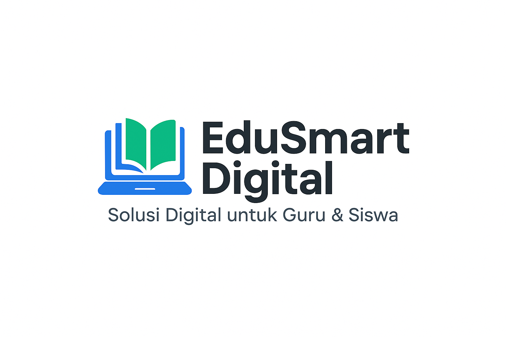

# 👋 Hi there, I'm EduSmart Digital

**EduSmart Digital** – Solusi Digital untuk Guru & Siswa 🇮🇩

Kami menciptakan aplikasi pendidikan dan solusi teknologi untuk memperkuat pembelajaran digital, administrasi sekolah, dan pengalaman guru & siswa yang lebih baik.

---

## 🎯 Tentang EduSmart Digital

📍 **Lokasi:** Indonesia  
💡 **Fokus:** Aplikasi Edukasi, Sistem Sekolah, LMS, AI Assistant  
📌 **Target:** Guru, Siswa, Sekolah, Pengembang EdTech

---

## 🚀 Apa yang Kami Bangun

### 🏫 Sistem Informasi Sekolah
- PPDB / SPMB Online
- Akademik & Nilai
- Absensi & Jadwal

### 📝 Solusi Guru
- Jurnal Kegiatan & RPP Digital
- Alat Administrasi Kurikulum
- Modul Ajar Deep Learning

### 📖 Pembelajaran Digital
- LMS SMK & SMA
- LKPD & Asesmen Interaktif
- AI Assistant untuk Guru & Siswa

---

## 🛠️ Teknologi yang Digunakan

- **Frontend:** HTML, CSS, JavaScript, Flutter  
- **Backend:** Laravel (PHP), Node.js  
- **Database:** MySQL, Firebase  
- **Tools:** Git, GitHub, REST API

---

## 🌟 Project Unggulan

| Nama Project | Deskripsi |
|-------------|-----------|
| **Jurnal Guru Digital** | Aplikasi lengkap untuk kegiatan guru dan kurikulum merdeka |
| **SPMB Online** | Sistem penerimaan siswa baru berbasis web |
| **LMS SMK EduSmart** | Platform pembelajaran interaktif |
| **Generator Modul Ajar** | Alat otomatisasi pembuatan modul |

---

## 💬 Hubungi

📫 **GitHub:** https://github.com/edusmartd  
📥 **Email:** edusmartd@gmail.com

---

## 📈 Statistik GitHub

---

⭐ Jika Anda menyukai project kami, jangan lupa untuk memberi **⭐ Star** dan **Follow**!

